<p align="center">
  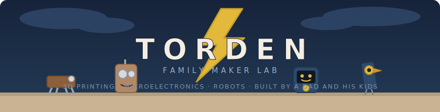
</p>

<p align="center">
  <a href="LICENSE"></a>
  <a href="CONTRIBUTING.md"></a>
  
  
  
</p>

<p align="center">
  <a href="#meet"></a>
  <a href="#map"></a>
  <a href="#weekend"></a>
  <a href="#backlog"></a>
  <a href="#start"></a>
</p>

> **TORDEN** (Norwegian: *thunder*) — a family maker lab for 3D printing, microelectronics, and robots. This repo is our open lab notebook: every build ships with CAD, firmware, wiring, BOM, and a guide, so anyone can build it again.

---

<a id="meet"></a>
## 👋 Meet the bots

<table>
  <tr>
    <td align="center" width="25%">
      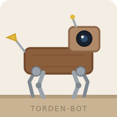<br>
      <b>TORDEN-BOT</b><br>
      <sub>Walking quadruped you teach by hand — it replays gaits and reacts to what it sees</sub>
    </td>
    <td align="center" width="25%">
      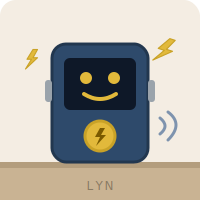<br>
      <b>LYN</b><br>
      <sub>Desk button + display that fires coding shortcuts and shows session state with a face</sub>
    </td>
    <td align="center" width="25%">
      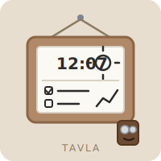<br>
      <b>TAVLA</b><br>
      <sub>E-paper wall board for weather, chores, and family life — sips power for weeks</sub>
    </td>
    <td align="center" width="25%">
      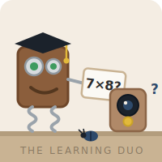<br>
      <b>SKROT-BOTS</b><br>
      <sub>The kids' scrap robots, brought to life with snap-in electronic "organs"</sub>
    </td>
  </tr>
</table>

| # | Project | Status | Tags |
|---|---------|--------|------|
| [01](projects/01-torden-bot/) | **TORDEN-BOT** — walking quadruped | 🔨 In progress | `ESP32` `servos` `vision` `teaching` |
| 02 | **LYN** — action button + display | 📋 Planned (spec below) | `M5Stack` `BLE HID` `display` |
| [03](https://github.com/bjadda/Waveshare-ePaper-10.85-dashboard) | **TAVLA** — e-paper family wall board | ✅ Live (satellite repo) | `RPi Zero 2W` `e-paper` `widgets` |
| 04 | **SKROT-BOTS** — electronics for scrap robots | 📋 Planned (spec below) | `ESP32-C3` `LEDs` `kid-first` |

---

<a id="map"></a>
## 🗺️ Lab map

How the projects fit together — build one, and the next one plugs into it.

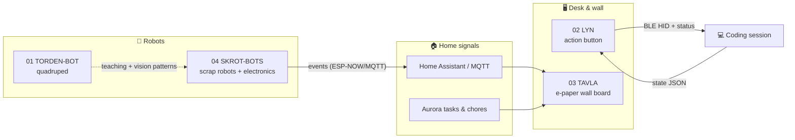

---

### 01 · TORDEN-BOT — the walking quadruped


3D-printed four-legged robot: grab a leg and **teach it poses by hand**, replay gaits, and let a vision model react to what it sees. The teaching + vision patterns built here feed every later bot.

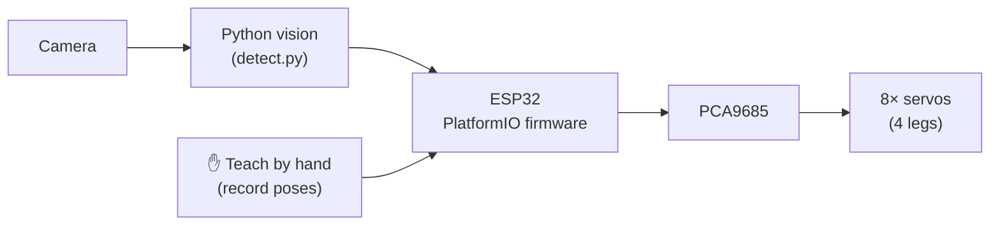

**Parts:** ESP32 · PCA9685 · SG90/MG90S servos · printed frame → [full project](projects/01-torden-bot/)

---

### 02 · LYN — the desk action button


*(Norwegian: lightning — thunder's fast little sibling.)* A palm-sized M5Stack device next to the keyboard: **press a button → it fires a prompt or shortcut into the coding session as a BLE keyboard**, and the display shows state at a glance — idle, working, waiting, usage high, done. A kid mode shows animated faces instead of account data.

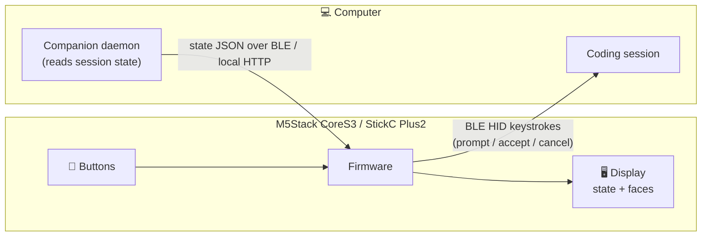

**Parts:** M5Stack CoreS3 (or M5StickC Plus2) · nothing else — it's all firmware.
**Patterns to steal:** [Clawdmeter](https://github.com/HermannBjorgvin/Clawdmeter) (BLE daemon + state display) · [StackChan](https://github.com/m5stack/StackChan) (expressions) · prompt template in [docs/ai-inputs.md](docs/ai-inputs.md).

---

### 03 · TAVLA — the e-paper family wall board *(live · satellite repo)*


*(Norwegian: the board.)* A Raspberry Pi Zero 2W wall dashboard on the Waveshare 10.85″ e-paper HAT+ — glanceable weather, calendar, chores, and home widgets that sip power. Lives in its own repo, **[Waveshare-ePaper-10.85-dashboard](https://github.com/bjadda/Waveshare-ePaper-10.85-dashboard)**, with a printed case on [MakerWorld](https://makerworld.com/en/models/2322517-epaper-dashboard-waveshare-10-85).

**How it works:** a Python renderer composes named regions from a widget library, driven by JSON profiles edited in a local web configurator; a patched driver does safe rectangular partial refreshes so the panel updates in seconds, not minutes; systemd keeps it alive and it falls back to logs when a widget or API misbehaves.

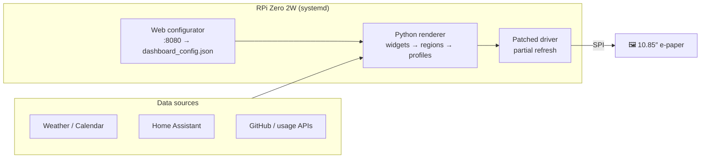

**TORDEN hook:** this is where SKROT-BOT events and chore tallies get displayed.

---

### 04 · SKROT-BOTS — electronics for scrap robots

*(Norwegian: skrot = scrap.)* The kids build robots from scrap — wood blocks, screws, springs, bottle caps, old keys. We give each one **an "organ transplant"**: small, reusable electronics modules that snap in and give the robot a personality. Same organs every time, so building the tenth bot is as easy as the first.

<p align="center">
  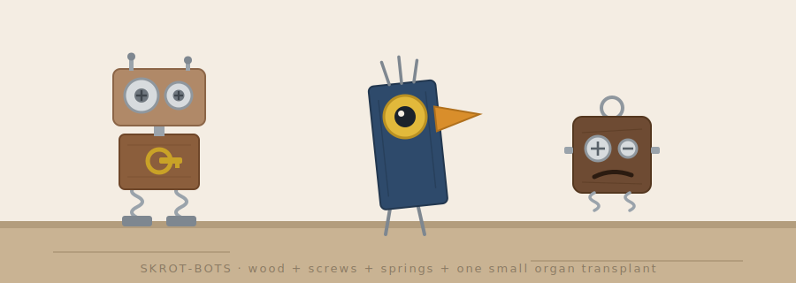
</p>

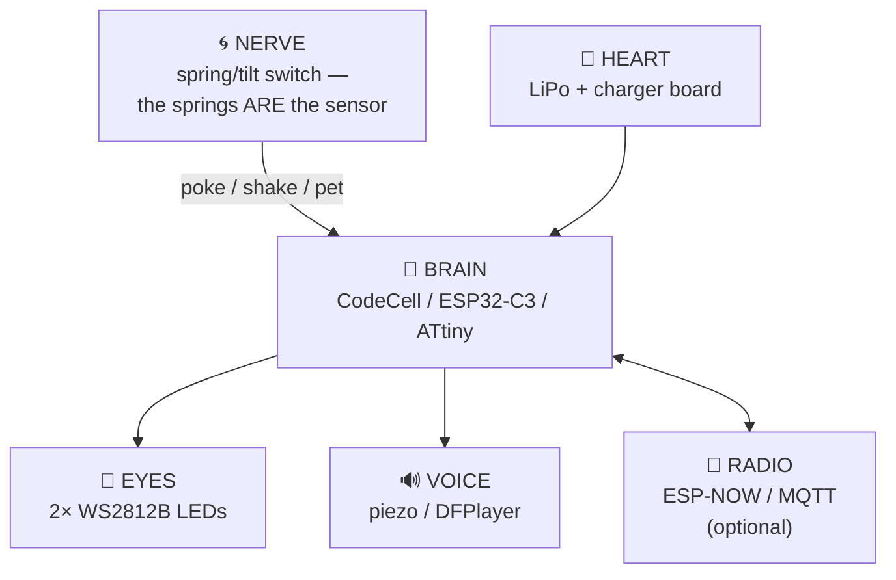

**The trick:** the scrap parts double as electronics. Springs are tilt switches, screws are touch contacts, a bottle cap is a button. Wood bodies get a 12 mm hole per organ; organs are potted in printed capsules with 2-pin JST connectors so small hands can swap them.

**Starter organ kit:** ESP32-C3 SuperMini or CodeCell · 2× WS2812B · LiPo 400 mAh + TP4056 · piezo disc · JST-PH leads.

---

<a id="weekend"></a>
## 💡 Weekend builds

Small SKROT-BOT-first projects that plug into the map above:

| Idea | What it does | Organs + extras |
|------|--------------|-----------------|
| **VAKTBOT** (nightlight guardian) | Scrap-bot whose LED eyes run the bedtime countdown: warm → amber → red → off. Pet its head (spring switch) to snooze 5 min | BRAIN + EYES + NERVE |
| **GJØREMÅL-O-METER** (chore-o-meter) | Feed it a "chore coin" when a task is done — tail wags (servo), score goes via MQTT to TAVLA | BRAIN + VOICE + RADIO + coin slot w/ IR beam + SG90 tail |
| **DØRFUGL** (door bird) | The button-eyed bird chirps and blinks when the doorbell/gate sensor fires — ESP-NOW, no wiring to the door | BRAIN + EYES + VOICE + RADIO |
| **STEMMEBOT** (voice bot) | Press its belly button → plays a random recorded family clip from a tin-can body | BRAIN + HEART + DFPlayer + speaker |

Each is a one-weekend build, and the chore-o-meter closes the loop: **scrap robot → MQTT → wall board.**

### 🎓 The learning duo


Two bots sharing one loop: the bot senses, a small companion daemon does the thinking, and the bot answers back in kid language. Guardrails live in the daemon — kid-safe prompt, nothing sensitive on-device, and an offline fallback so the bots still work when the internet doesn't.

| Idea | What it does | Learning angle |
|------|--------------|----------------|
| **HVA-ER-DET?** (what-is-it? camera bot) | Scrap-bot with a camera eye. Point it at *anything* — a beetle, a circuit board, grandma's eggbeater — press its nose, and it **speaks a kid-level explanation** of what it sees and how it works | Instant curiosity machine; follow-up button asks "why?" up to three levels deep |
| **LÆREBOT** (flash-card buddy) | Desk scrap-bot that runs 5-minute practice rounds: times tables, spelling, Norwegian↔English. Answer with buttons or voice; eyes light up green streaks, tail wags at milestones | Spaced repetition tuned to each kid; weekly progress lands on TAVLA, and the deck falls back to stored cards offline |

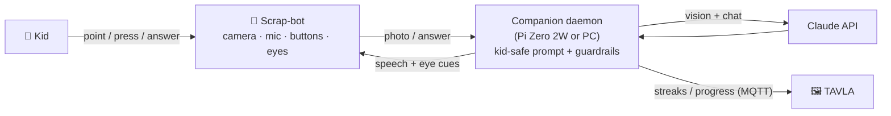

Same daemon pattern as **LYN** — build it once, every bot reuses it.

---

<a id="backlog"></a>

<details>
<summary>📚 <strong>Open-source references to study</strong></summary>

| Project | Why it matters | Link |
|---|---|---|
| Stack-chan | M5Stack/CoreS3 desktop robot with expression, speech, servos, case files, and community firmware | https://github.com/m5stack/StackChan |
| Stack-chan classic | JavaScript-driven M5Stack companion robot with firmware, case, and schematics | https://github.com/stack-chan/stack-chan |
| Clawdmeter | ESP32-S3 AMOLED desktop dashboard for Claude Code usage, BLE daemon, buttons, and board abstraction | https://github.com/HermannBjorgvin/Clawdmeter |
| Claude Code Usage Monitor | Terminal usage monitor that can feed a physical dashboard or e-paper display | https://github.com/Maciek-roboblog/Claude-Code-Usage-Monitor |
| ESP Web Tools | Browser-based ESP flashing flow for making kid-friendly install pages | https://esphome.github.io/esp-web-tools/ |
| ESPHome | YAML-driven ESP32/ESP8266 firmware for sensors, displays, Home Assistant, and OTA updates | https://github.com/esphome/esphome |
| Home Assistant Voice PE | Open ESPHome source for a local voice-assistant appliance | https://github.com/esphome/home-assistant-voice-pe |
| WLED | Mature ESP32/ESP8266 LED control firmware for desk lamps, signs, panels, and light toys | https://github.com/WLED/WLED |
| OpenMQTTGateway | ESP32 gateway pattern for BLE/RF/IR/LoRa sensors into MQTT | https://github.com/1technophile/OpenMQTTGateway |

Use these as reference architecture, not copy-paste targets. The useful patterns are board abstraction, web flashing, local-first device control, BLE/Wi-Fi transport, clear hardware matrices, and small reproducible build docs.

</details>

<details>
<summary>🔎 <strong>Recent inspiration inputs</strong> (browsing signals, not purchases)</summary>

| Signal | Project angle |
|---|---|
| Raspberry Pi Zero 2W | Cheap co-processor for camera, speech, local web UI, or bridge daemon |
| Waveshare 7.5 / 10.85 e-paper | Family wall dashboard, low-power task board, pantry card, or offline build checklist |
| M5Stick/CoreS3 searches | Desktop companion that sends prompts, shows usage, or controls coding workflows |
| Clawdmeter / usage monitors | Physical meter for coding-session limits, model state, or agent queue health |
| 24V IP65 LED power supplies | Outdoor/weatherproof LED controller, maker bench power rail, or RC charging station |
| SCADA searches | Kid-safe mini industrial control panel: pumps, valves, status lamps, alarms, and dashboard |
| SwitchBot-style actuator | Small servo finger for pressing toy buttons, lamps, or test fixtures |
| CodeCell C6 / tiny sensor boards | Pocket motion/light/proximity input puck for toys and small robots |
| RC / drone / small robot videos | Camera rover, obstacle course bot, or telepresence toy with safety limits |
| Camping/prepper gear | Portable sensor box: weather, power, radio checklist, and family readiness dashboard |

</details>

<details>
<summary>🧾 <strong>Ideas backlog</strong> (pick one and run — ordered by complexity)</summary>

### Beginner — first soldering / first print

| Idea | What it is | Key parts |
|------|-----------|-----------|
| **Weather station** | ESP32 reads temp/humidity/pressure, 3D-printed enclosure on the windowsill, syncs to a web dashboard | ESP32, BME280, e-ink display |
| **Name sign** | 3D-printed letters with WS2812B LEDs behind them — lights up, animations via phone | ESP32, WS2812B strip, custom letter molds |
| **Reaction game** | 3D-printed box with 4 coloured buttons and LEDs — plays Simon Says, records high scores | Arduino Nano, 4× LED, 4× button |
| **Plant watering bot** | Soil moisture sensor triggers a mini pump when it gets dry, logs readings | ESP32, capacitive moisture sensor, 5V pump, relay |
| **Fidget cube** | Fully mechanical — buttons, joystick, dials — nothing electronic, pure CAD and print | FDM print only |

### Intermediate — combining sensors + code + CAD

| Idea | What it is | Key parts |
|------|-----------|-----------|
| **Mechanical flip-clock** | 3D-printed split-flap display driven by servos, NTP time sync | ESP32, SG90 servos, PCA9685, NTP |
| **Mini arcade cabinet** | Tiny tabletop cabinet with screen + buttons, runs custom games | RP2040, 2.8" TFT, 3D-printed cabinet shell |
| **Gesture lamp** | Swipe hand over lamp to change colour/brightness — no buttons | ESP32, APDS9960 gesture sensor, NeoPixel ring, printed shade |
| **Star tracker** | Motorised mount slowly rotates a camera to follow stars — for long-exposure photos | ESP32, 2× stepper motor, A4988 driver, worm gear CAD |
| **Binary clock** | Tells time in binary using LEDs — learn binary while telling the time | Arduino, 12× LED matrix, DS3231 RTC module |
| **Mini SCADA trainer** | Tabletop pump/valve/tank simulator with status lamps and a browser dashboard | ESP32, peristaltic pump or LEDs-only mock, relays/MOSFETs, pressure/level sensors |
| **SwitchBot-style servo finger** | Small printable actuator that presses a button on command and reports position/state | ESP32-C3/C6, SG90/MG90S servo, limit switch, magnetic mount |
| **Weatherproof LED controller** | IP65 24V LED strip controller for outdoor signs or playhouse lighting | ESP32, 24V PSU, MOSFET driver, IP65 enclosure, WLED |

### Advanced — multi-week builds

| Idea | What it is | Key parts |
|------|-----------|-----------|
| **TORDEN-ARM** | 3D-printed 4-DOF robot arm — teach positions by hand, replay, controlled via web UI | ESP32, 4× MG996R, PCA9685, same teaching mode as TORDEN-BOT |
| **Autonomous rover** | Tracked chassis, maps a room using a TOF sensor array, avoids obstacles | ESP32, VL53L5CX TOF, L298N motor driver, tracked base |
| **Thermal camera** | ESP32 + thermal array sensor shows hot spots in real time — useful for electronics debugging | ESP32, MLX90640, TFT display, 3D-printed gun housing |
| **Weather balloon payload** | GPS + sensors + camera in a printed enclosure, recovers after flight | ESP32, NEO-6M GPS, BME280, SD card logger |
| **Holographic persistence-of-vision display** | Spinning LED bar creates floating 3D image | ESP32, WS2812B strip, brushless motor + slip ring, CAD mount |
| **Family voice appliance** | Local voice/display appliance that can add Aurora tasks, read shopping lists, and queue TORDEN build steps | ESP32-S3 Box/CoreS3, microphone, speaker, Home Assistant Voice PE patterns |
| **RC camera rover** | Small RC/telepresence rover with live camera, child-safe speed limits, and obstacle detection | ESP32-CAM or Pi Zero 2W, camera, motor driver, ultrasonic/ToF sensors |

</details>

---

<a id="start"></a>
## 🚀 Start a project

```bash
git clone https://github.com/bjadda/TORDEN-familylab.git
cd TORDEN-familylab

# Flash firmware (PlatformIO)
cd projects/01-torden-bot/firmware && pio run --target upload

# Run the vision scripts
cd ../ai && pip install -r requirements.txt && python vision/detect.py
```

**Starting something new?** Copy [`templates/project-template/`](templates/project-template/) to `projects/NN-name/`, and feed [docs/ai-inputs.md](docs/ai-inputs.md) to your coding assistant first — it carries the repo conventions and ready prompts for M5Stack, e-paper, and dashboard builds. House rules live in [CONTRIBUTING.md](CONTRIBUTING.md).

## 🛠️ Tools we use

| Category | Tool |
|----------|------|
| 3D modelling | Fusion 360 / FreeCAD |
| Slicing | PrusaSlicer / Bambu Studio |
| Firmware | PlatformIO (VS Code) + Arduino framework |
| Vision / Python | TensorFlow Lite, OpenCV, Python 3 |
| Wiring diagrams | KiCad / Fritzing |
| Version control | Git + GitHub |

## 📁 Repo layout

```
projects/
  01-torden-bot/          # Walking quadruped robot
  02-lyn/                 # Desk action button (planned)
  04-skrot-bots/          # Scrap-robot organ modules (planned)
docs/
  hero-banner.svg         # README artwork (+ bot-*.svg icons)
  ai-inputs.md            # Prompt inputs for new builds
  inspiration-board.png   # Visual direction reference
templates/
  project-template/       # Copy this to start a new project
```
*(03 · TAVLA lives in its own repo: [Waveshare-ePaper-10.85-dashboard](https://github.com/bjadda/Waveshare-ePaper-10.85-dashboard).)*

---

<p align="center">
  <sub>⚡ MIT licensed — see <a href="LICENSE">LICENSE</a>. Build it, mod it, share it. If your kids build a bot, we want to see it — open an issue with a photo.</sub>
</p>
