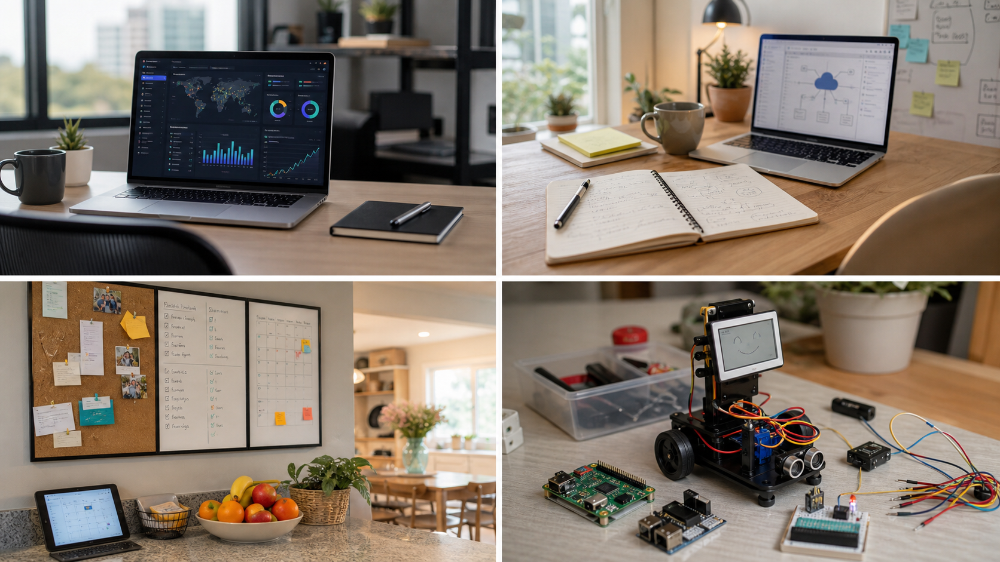

# ⚡ TORDEN — Family Maker Lab

> **TORDEN** (Norwegian: *thunder*) — a shared workspace for 3D printing, microelectronics, and AI projects built by a dad and his kids.

This repo is our open-source lab notebook. Every project lives here — from first sketches to finished builds. Everything is designed to be reproducible: full CAD files, firmware, wiring diagrams, BOM, and build guides included.



The direction is practical family hardware: small enough to finish on weekends, useful enough to stay on a desk or kitchen wall, and documented clearly enough that Claude/Codex can help generate firmware, CAD notes, wiring checks, and build guides.

---

## 🤖 Active projects

| # | Project | Status | Tags |
|---|---------|--------|------|
| [01](projects/01-torden-bot/) | **TORDEN-BOT** — AI walking quadruped robot | 🔨 In progress | `ESP32` `3D-print` `servos` `AI` `vision` `teaching` |

---

## Open-source references to study

| Project | Why it matters | Link |
|---|---|---|
| Stack-chan | M5Stack/CoreS3 desktop robot with expression, speech, servos, case files, and community firmware | https://github.com/m5stack/StackChan |
| Stack-chan classic | JavaScript-driven M5Stack companion robot with firmware, case, and schematics | https://github.com/stack-chan/stack-chan |
| Clawdmeter | ESP32-S3 AMOLED desktop dashboard for Claude Code usage, BLE daemon, buttons, and board abstraction | https://github.com/HermannBjorgvin/Clawdmeter |
| Claude Code Usage Monitor | Terminal usage monitor that can feed a physical dashboard or e-paper display | https://github.com/Maciek-roboblog/Claude-Code-Usage-Monitor |
| ESP Web Tools | Browser-based ESP flashing flow for making kid-friendly install pages | https://esphome.github.io/esp-web-tools/ |
| ESPHome | YAML-driven ESP32/ESP8266 firmware for sensors, displays, Home Assistant, and OTA updates | https://github.com/esphome/esphome |
| Home Assistant Voice PE | Open ESPHome source for a local voice-assistant appliance | https://github.com/esphome/home-assistant-voice-pe |
| WLED | Mature ESP32/ESP8266 LED control firmware for desk lamps, signs, panels, and light toys | https://github.com/WLED/WLED |
| OpenMQTTGateway | ESP32 gateway pattern for BLE/RF/IR/LoRa sensors into MQTT | https://github.com/1technophile/OpenMQTTGateway |

Use these as reference architecture, not copy-paste targets. The useful patterns are board abstraction, web flashing, local-first device control, BLE/Wi-Fi transport, clear hardware matrices, and small reproducible build docs.

---

## Recent inspiration inputs

These came from local Chrome history and AliExpress browsing signals, not confirmed purchase data:

| Signal | Project angle |
|---|---|
| Raspberry Pi Zero 2W | Cheap AI co-processor for camera, speech, local web UI, or bridge daemon |
| Waveshare 7.5 / 10.85 e-paper | Family wall dashboard, low-power task board, pantry card, or offline build checklist |
| Claude/M5Stick/CoreS3 searches | Desktop AI companion that sends prompts, shows usage, or controls Claude/Codex workflows |
| Clawdmeter / Claude usage monitor | Physical meter for coding-session limits, model state, or agent queue health |
| 24V IP65 LED power supplies | Outdoor/weatherproof LED controller, maker bench power rail, or RC charging station |
| SCADA searches | Kid-safe mini industrial control panel: pumps, valves, status lamps, alarms, and dashboard |
| SwitchBot-style actuator | Small servo finger for pressing toy buttons, lamps, or test fixtures |
| CodeCell C6 / tiny sensor boards | Pocket motion/light/proximity input puck for toys and small robots |
| RC / drone / small robot videos | Camera rover, obstacle course bot, or telepresence toy with safety limits |
| Camping/prepper gear | Portable sensor box: weather, power, radio checklist, and family readiness dashboard |

---

## 💡 Ideas backlog

Not started yet — pick one and run with it. Roughly ordered by complexity.

### Beginner — first soldering / first print

| Idea | What it is | Key parts |
|------|-----------|-----------|
| **Weather station** | ESP32 reads temp/humidity/pressure, 3D-printed enclosure on the windowsill, syncs to a web dashboard | ESP32, BME280, e-ink display |
| **Name sign** | 3D-printed letters with WS2812B LEDs behind them — lights up, animations via phone | ESP32, WS2812B strip, custom letter molds |
| **Reaction game** | 3D-printed box with 4 coloured buttons and LEDs — plays Simon Says, records high scores | Arduino Nano, 4× LED, 4× button |
| **Plant watering bot** | Soil moisture sensor triggers a mini pump when it gets dry, logs readings | ESP32, capacitive moisture sensor, 5V pump, relay |
| **Fidget cube** | Fully mechanical — buttons, joystick, dials — nothing electronic, pure CAD and print | FDM print only |
| **Claude/Codex desk button** | M5Stick/CoreS3-style button/display that sends a prompt, shows current model/session state, and acts as a BLE keyboard | M5Stack CoreS3 or M5StickC Plus2, BLE HID, small display |
| **E-paper daily card** | Low-power display for today’s chores, weather, meals, and shopping priorities from Aurora | Waveshare 7.5" or 10.85" e-paper, ESP32/RPi Zero 2W |

### Intermediate — combining sensors + code + CAD

| Idea | What it is | Key parts |
|------|-----------|-----------|
| **Mechanical flip-clock** | 3D-printed split-flap display driven by servos, NTP time sync | ESP32, SG90 servos, PCA9685, NTP |
| **Mini arcade cabinet** | Tiny tabletop cabinet with screen + buttons, runs custom games | RP2040, 2.8" TFT, 3D-printed cabinet shell |
| **Gesture lamp** | Swipe hand over lamp to change colour/brightness — no buttons | ESP32, APDS9960 gesture sensor, NeoPixel ring, printed shade |
| **Star tracker** | Motorised mount slowly rotates a camera to follow stars — for long-exposure photos | ESP32, 2× stepper motor, A4988 driver, worm gear CAD |
| **Binary clock** | Tells time in binary using LEDs — learn binary while telling the time | Arduino, 12× LED matrix, DS3231 RTC module |
| **Mini SCADA trainer** | Tabletop pump/valve/tank simulator with status lamps and a browser dashboard | ESP32, peristaltic pump or LEDs-only mock, relays/MOSFETs, pressure/level sensors |
| **SwitchBot-style servo finger** | Small printable actuator that presses a button on command and reports position/state | ESP32-C3/C6, SG90/MG90S servo, limit switch, magnetic mount |
| **Weatherproof LED controller** | IP65 24V LED strip controller for outdoor signs or playhouse lighting | ESP32, 24V PSU, MOSFET driver, IP65 enclosure, WLED |

### Advanced — multi-week builds

| Idea | What it is | Key parts |
|------|-----------|-----------|
| **TORDEN-ARM** | 3D-printed 4-DOF robot arm — teach positions by hand, replay, controlled via web UI | ESP32, 4× MG996R, PCA9685, same teaching mode as TORDEN-BOT |
| **Autonomous rover** | Tracked chassis, maps a room using a TOF sensor array, avoids obstacles | ESP32, VL53L5CX TOF, L298N motor driver, tracked base |
| **AI thermal camera** | ESP32 + thermal array sensor shows hot spots in real time — useful for electronics debugging | ESP32, MLX90640, TFT display, 3D-printed gun housing |
| **Weather balloon payload** | GPS + sensors + camera in a printed enclosure, recovers after flight | ESP32, NEO-6M GPS, BME280, SD card logger |
| **Holographic persistence-of-vision display** | Spinning LED bar creates floating 3D image | ESP32, WS2812B strip, brushless motor + slip ring, CAD mount |
| **Family agent appliance** | Local voice/display appliance that can add Aurora tasks, read shopping lists, and queue TORDEN build steps | ESP32-S3 Box/CoreS3, microphone, speaker, Home Assistant Voice PE patterns |
| **RC camera rover** | Small RC/telepresence rover with live camera, child-safe speed limits, and obstacle detection | ESP32-CAM or Pi Zero 2W, camera, motor driver, ultrasonic/ToF sensors |

---

## 🛠️ Tools we use

| Category | Tool |
|----------|------|
| 3D modelling | Fusion 360 / FreeCAD |
| Slicing | PrusaSlicer / Bambu Studio |
| Firmware | PlatformIO (VS Code) + Arduino framework |
| AI / Python | TensorFlow Lite, OpenCV, Python 3 |
| Wiring diagrams | KiCad / Fritzing |
| Version control | Git + GitHub |

---

## 📁 Repo layout

```
projects/
  01-torden-bot/          # AI walking quadruped robot
  02-.../                 # Future projects
docs/
  inspiration-board.png   # Visual direction reference
  ai-inputs.md            # Claude/Codex prompt inputs for new builds
templates/
  project-template/       # Copy this to start a new project
```

---

## 🚀 Getting started

### Clone
```bash
git clone https://github.com/bjadda/TORDEN-ESP32.git
cd TORDEN-ESP32
```

### Flash firmware (PlatformIO)
```bash
cd projects/01-torden-bot/firmware
pio run --target upload
```

### Run AI scripts
```bash
cd projects/01-torden-bot/ai
pip install -r requirements.txt
python vision/detect.py
```

### Claude/Codex input prompts

Use [docs/ai-inputs.md](docs/ai-inputs.md) when starting a new hardware project with Claude or Codex. It captures the repo conventions, output expectations, and a ready prompt for M5Stack/CoreS3, M5Stick-style, e-paper, and Claude/Codex dashboard projects.

---

## 📜 License

MIT — see [LICENSE](LICENSE). Build it, mod it, share it.
